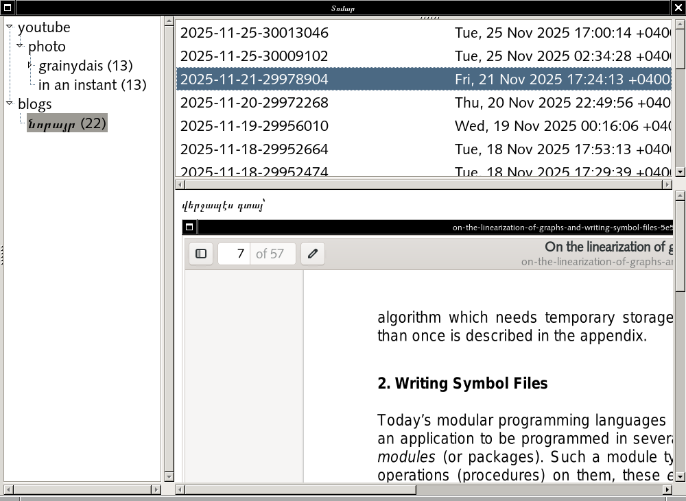
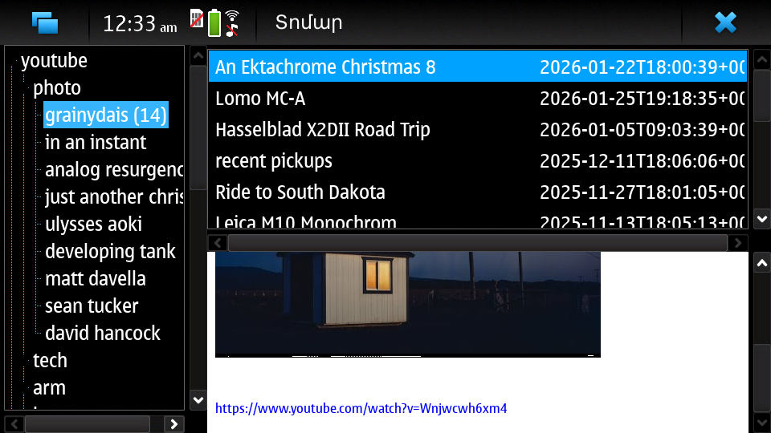
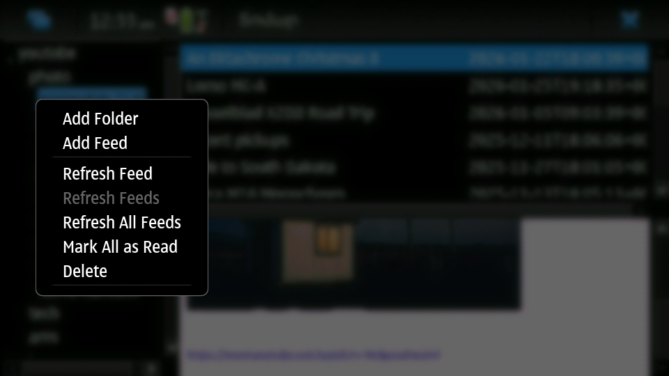
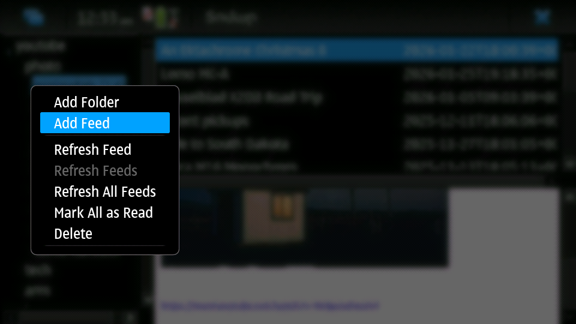
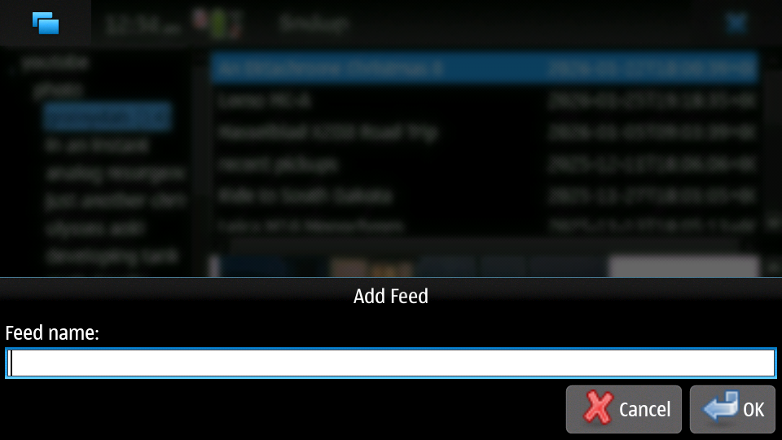

# tomar (տոմար)

very simple, pure pascal rss reader without dependencies.




## build

easiest

```
./lazbuild rssreader.lpi
```

apparently it even builds and works in maemo-leste, which makes it very useful there to get youtube links and watch without browser.

we specifically made an effort to handle long press as right click so that it would be useful on mobile devices.










